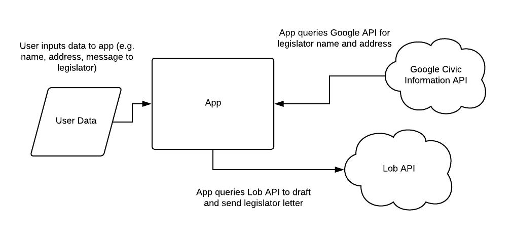

# legislator-letter
A program to send a letter to your legislator.

## System diagram
Here's a basic diagram of how the app interacts with other components in the system.

## Getting started

### How to install dependencies
Run `npm install` in root directory.

### How to run app
Run `npm start` in root directory.

### How to use app
Follow directions in the command line, filling out inputs as prompted.

## Notes
Built with Node and Lob API.
